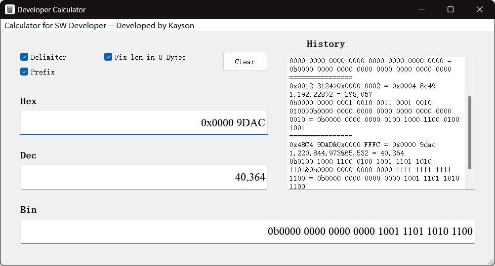

This is an initial commitment. It was developed mainly to simplify the work and make it easier to calculate the address of a computer. And I don't think Microsoft's calculator is good and efficient enough (or even hard to use).

It only supports two number operations in v0.1.0, including +, -, *, /, &, |, !, ~, >, <, ^ and only works on windows OS now.

Only developed it for 2 days to realize basic features and I didn't know QT before (which means this project probably has a lot of elementary syntax errors as well as bugs and is not beautifully written lol :) ).

If you have only suggestions or questions, please feel free to put them in Issues.

Open this project in QT Creator & build & run

-------

Usage:

